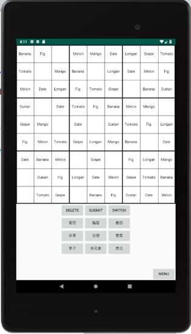
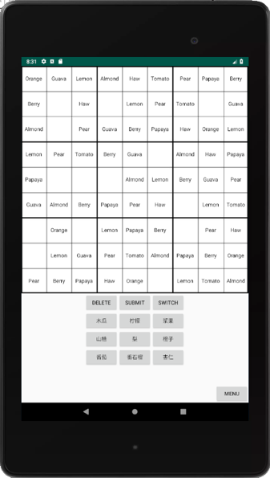
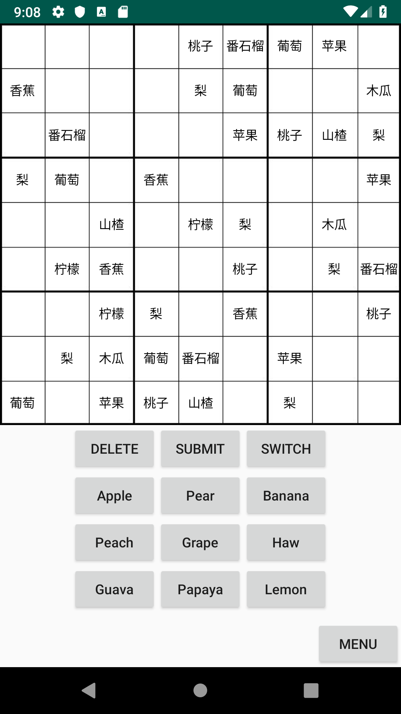
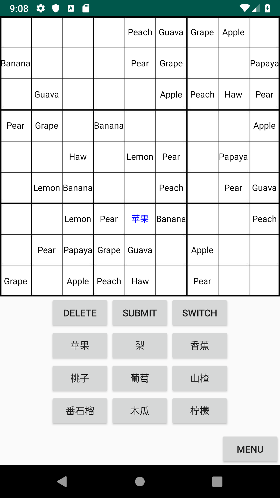
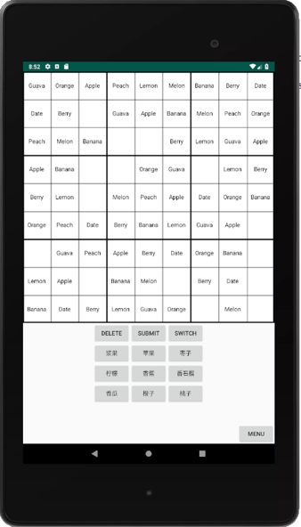
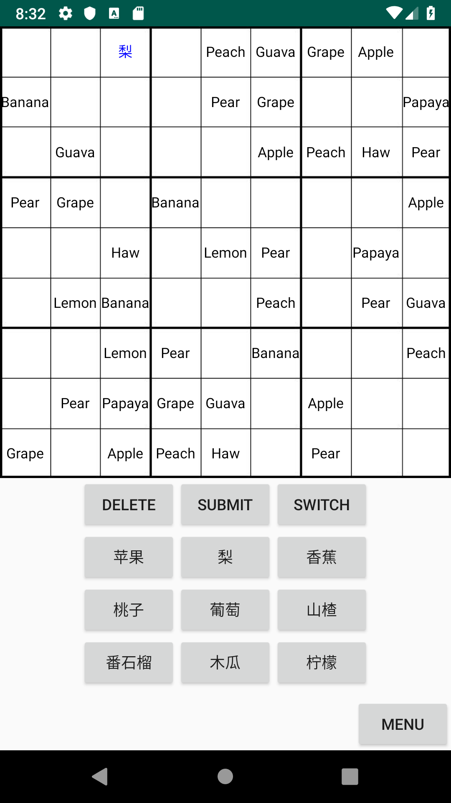
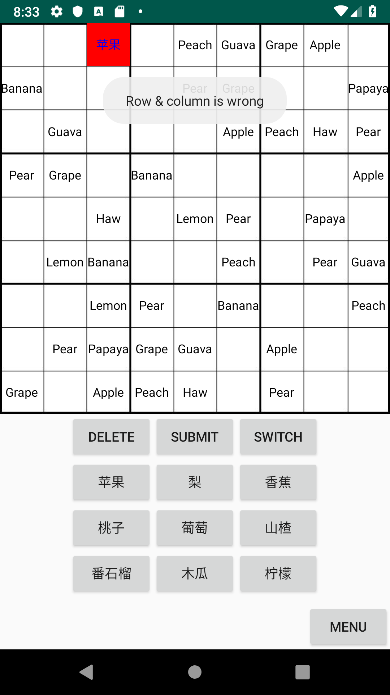
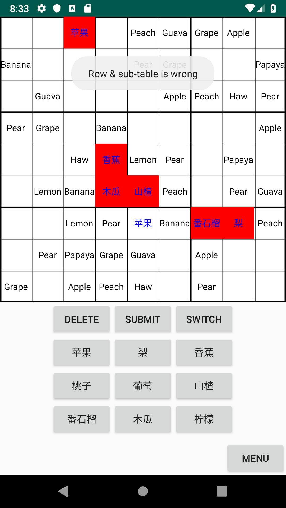
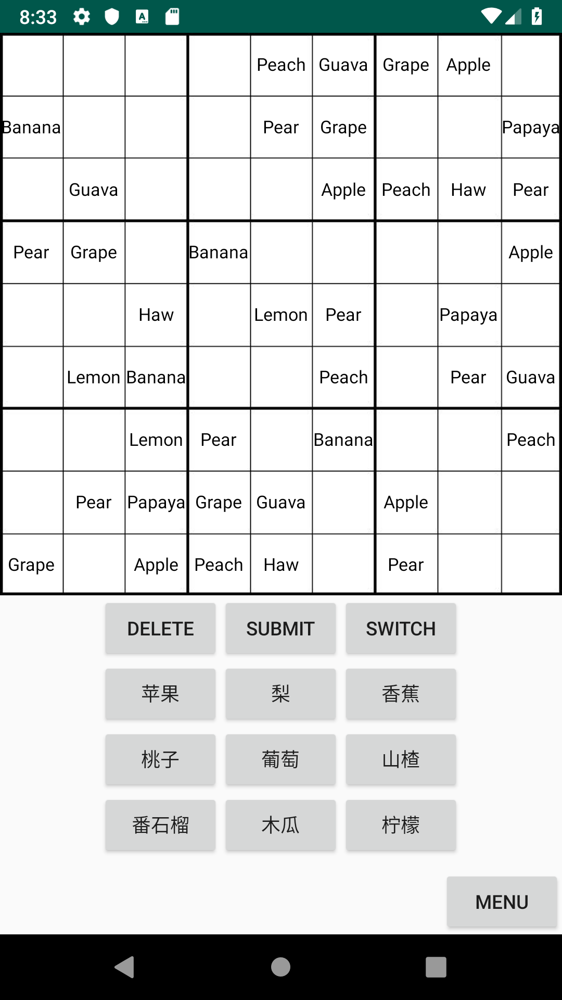

# CMPT276-1191E1-Eta

### Initial Goal
As a student, I want to be able to learn Chinese by playing a Sudoku style game. I want to get familiar with the words by playing this game.
Example: The game will have two modes, students can choose the mode they like to play the game. It can help the student to get familiar with the languages they want.

### First Game
As a language learner, I would like to start with the numbers at first. I want to learn 1 - 9 in Chinese.
Example: User will input numerical number into a Chinese puzzle, and input Chinese numbers into a regular puzzle to play.

### Puzzle End
As a student, I need to know when I have the correct solution to learn the language properly.  
Example: There is a "submit" button that will check if the current solution is correct.

### Selection GUI
As a student, I want to be able to select a desired number to place on the board.  
Example: A 3 by 3 grid will be available at the bottom of the screen to pick a desired number to fill in a blank spot.  
The student can select the desired number from the 3 x 3 grid then select board position to set board values.  
Example: A "delete" button is available so the user can press it then the desired position on the board to clear that spot.
         

### Language Selection
As a language learner, I want to be able to peek at the correct translation of a word, so that I can try to remember it in filling out the puzzle.  
Example: A "switch" button is available to switch the languages back and forth. This way, the learner can peak as they play the game.  
Note: Variable is available in MainActivity.java to switch initial lanugages.

### Listening Comprehension

As a student who wants to practice my understanding of spoken words in the language that I am learning, I want a listening comprehension mode. In this mode, numbers will appear in the prefilled cells and the corresponding word in the language that I am learning will be read out to me when I press the number.

### Vocabulary Lists

As a teacher, I want to specify a list of word pairs for my students to practice this week.
As a student working with a textbook, I want to load pairs of words to practice from each chapter of the book.
As a student, I want the Sudoku app to keep track of the vocabulary words that I am having difficulty recognizing so that they will be used more often in my practice puzzles.

### Different Devices

As a vocabulary learner practicing at home, I want to use my tablet for Sudoku vocabulary practice, so that the words will be conveniently displayed in larger, easier to read fonts.
As a vocabulary learner taking the bus, I want to use my phone in landscape mode for Sudoku vocabulary practice, so that longer words are displayed in a larger font that standard mode.

### Submit Button
Example: There is a "submit" button that will check if the current solution is correct.

Given: The user is playing a game.

When: The user presses submit.

Then:  The game checks if you solution is correct and display a message to indicate the result.

Before:     After:  

### Switch Button

Example: A "switch" button is available to switch the languages back and forth. This way, the learner can peak as they play the game.

Given: The user is in a game and wants to swap the board and button languages.

When: The user presses switch.

Then: The current board language switches the button language and the current button language switches to the board language.

Before:     After:  

### Delete Button

Example: A "delete" button is available so the user can press it then the desired position on the board to clear that spot.

Given: The user is in a game and wants to delete one of the words they put in the board previously.

When: User presses delete then presses desired word to remove.

Then: The desired word turns into a blank spot on the board.

Before:     After:  

### ITERATION 3

### Challenge mode

As a teacher who wants to make sure my student understands the vocabs, student must pass some tests. I want a challenge mode where the student must complete my difficulty requirement in certain amount of time.
If student completes them succcesfully, they pass the test. If they don't, they will fail and must try again.

Example: A student need to pass a 9x9 puzzle in under 10 minutes, then the 9 words in this puzzle will consider learned or understood.

Given:challenge mode is enable
When:user initate a puzzle with timer count down
Then:user must complete the puzzle within certain amount of time to pass, else fail

As a teacher, I want the hints be off on the Challenge mode.

Example: No more hints when you click on prefilled cells, and other pop ups.

Given:challenge mode is enable
When:user click on a prefill cell
Then:nothing pops up

                              
Before:     After:  

### Pratice mode

As a student who wants to pass the challenge. I want a pratice mode where I can pratice with no time limit but has a timer on the side and tells me how much time I spent on the game in the end.

Example: Student can pratice on any puzzle. It will have all hint functions and a timer on the side. When it is complete they will know their time spent.

Given:practice mode enable
When:user click on a prefill cell
Then:shows hints

Before:     After:  

### Useful feature

As a student who forgot my last number placed and want to go back, I want a button to back to it.

Example: Student erased apple and put down pear, they want to go back from pear to apple so they click undo.

Given:that the user is filling in the sudoku in any mode
      and student erased a apple
      and put down a pear on the same cell
When:user press the undo button
Then:cell will change from pear back to apple

Before:     After:  

As a student who messed up most of the puzzle, I would like to clean all the filled cells and start over.

Example: Student have to many error on the puzzle and doesn't want to fix one by one so they clean all.

Given:the user is filling in sudoku in any mode
When:user press the reset button
Then:it will clear all filled cells

Before:     After:  

As a student who clicked undo and figure it's not what I wants, I want a button to redo the change.

Example: Student erased apple and put down pear, click undo and go back to apple. then he wants to go it back to pear, so he clicks redo.

Given:student erased apple and put down pear in the same cell
      undo button is pressed
      now the cell will change back to apple to pear
When:press the redo
Then:the cells change back to pear from apple

Before:     After:  

### Update vocab list

As a teacher who wants student to learn Chinese, I would like to have a good mix of different categories of words.

Example: I want more groups of words, like animals, plants, or others.

As a teacher who wants student to learn better, I would like to have my set words for student to learn each week.

Example: I want to pick my own set of words for my student each week for them to learn.

### user preference

As a student who plays the sudoku game, doesn't like the bright red when the word is wrong, would like a lighter color

Example: I want the wrong color to be a bit lighter, it is too bring right now

